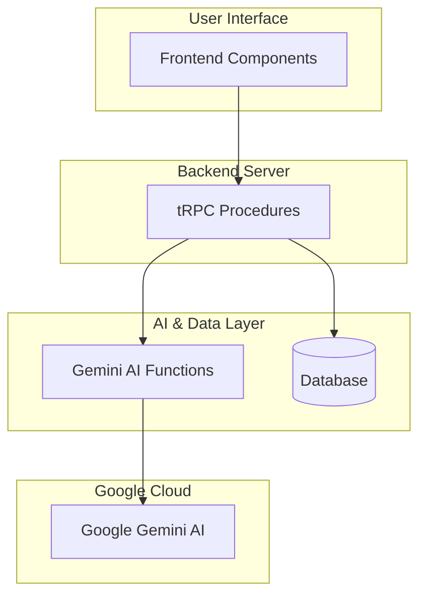
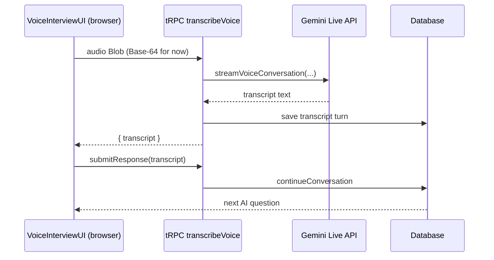

# Interviewer-Pro: System Architecture & Development Roadmap

> **Document Purpose**: The single source of truth for Interviewer-Pro's architecture, data flow, API contracts, and development roadmap. This document consolidates all previous planning and architecture maps into one cohesive guide.

---

## 📋 Table of Contents
1.  [**System Overview & Guiding Principles**](#-1-system-overview--guiding-principles)
2.  [**Core Interview Flow: User-Controlled Topics**](#-2-core-interview-flow-user-controlled-topics)
3.  [**API Reference & Data Flow**](#-3-api-reference--data-flow)
    -   [Frontend Components](#frontend-components)
    -   [Backend tRPC Procedures](#backend-trpc-procedures)
    -   [Gemini AI Service Layer](#gemini-ai-service-layer)
4.  [**Data Structures & Context Management**](#-4-data-structures--context-management)
5.  [**Development Roadmap**](#-5-development-roadmap)
    -   [Phase 3C: Multi-Modal Support (Live Voice – ✅ initial slice delivered)](#-phase-3c-multi-modal-support-live-voice--initial-slice-delivered)
    -   [Phase 4: Interview Panel Mechanism](#-phase-4-interview-panel-mechanism)
    -   [Prompt Engineering Workflow](#prompt-engineering-workflow)
6.  [**Production Readiness & Future Enhancements**](#-6-production-readiness--future-enhancements)

---

## 🏗️ 1. System Overview & Guiding Principles

The application follows a clean **Frontend → tRPC → Gemini API** architecture with well-separated concerns and a user-controlled interview flow.



### Guiding Principles

1.  **Incremental Value:** Each development phase must deliver a tangible improvement to the user experience.
2.  **Continuous Improvement:** The system, especially AI prompts, is never "done." We will continuously iterate and refine based on observed outputs and user feedback.
3.  **Data-Driven Decisions:** Use success metrics and user feedback to determine when and if to proceed to the next phase. Avoid implementing features based on assumptions.

---

## 🌊 2. Core Interview Flow: User-Controlled Topics

The system's core logic is now driven by the session's state, which is loaded on page entry. This provides a robust and predictable user experience.

### The Flow

```mermaid
graph TD
    A[Start: User navigates to session page] --> B{tRPC: getActiveSession}
    B -- Session Found --> C[Display Current State]
    B -- Session Not Found/Completed --> D[Show 'Start' or 'Report' options]

    C --> E{User sends chat message}
    E --> F[tRPC: submitResponse]
    F --> G[continueConversation]
    G --> H[AI Follow-up in Chat]
    H --> E

    C --> I{User clicks "Next Question"}
    I --> J[tRPC: getNextTopicalQuestion]
    J --> K[getNewTopicalQuestion]
    K --> L[Current Question #2 Displayed]
    L --> E
```

### Separation of Concerns

This architecture creates a clear and predictable user experience.

| Function Called | User Action | AI Prompt Focus | UI Destination |
| :--- | :--- | :--- | :--- |
| `getActiveSession()` | Page load | *(None - DB only)* | Entire UI state |
| `submitResponse()` | Sends a chat message | Dig deeper, provide feedback, ask follow-up on **same topic** | Chat history |
| `getNextTopicalQuestion()` | Clicks "Next Question" button | Move to unexplored area, generate a **new topic** | "Current Question" section |
| `startInterviewSession()` | Clicks "Reset" | Re-initialize the session with the first question | "Current Question" section |
| `saveSession()` | Clicks "Save" or "End" | *(None - DB only)* | Save progress or end session |

---

## ⚙️ 3. API Reference & Data Flow

This section details the specific functions and procedures that power the interview flow.

### Frontend Components

-   **Location**: `src/app/(protected)/sessions/[id]/page.tsx`
-   **Role**: Main orchestrator component that handles session lifecycle and manages state.
-   **tRPC Hooks Used**:
    -   `api.session.getActiveSession.useQuery`: Fetches the current state of an interview.
    -   `api.session.startInterviewSession.useMutation`: Re-initializes an interview for a "reset" flow.
    -   `api.session.submitResponse.useMutation`: Sends user's chat message for a conversational response.
    -   `api.session.getNextTopicalQuestion.useMutation`: Requests a new topic.
    -   `api.session.saveSession.useMutation`: Saves progress or ends the interview.
    -   `api.session.generateInterviewQuestion.useQuery`: Generates a standalone sample question.

### Backend tRPC Procedures

-   **Location**: `src/server/api/routers/session.ts`
-   **Role**: Exposes backend functionality to the frontend via a type-safe API.

| tRPC Procedure | Calls Gemini Function | Purpose |
| :--- | :--- | :--- |
| `createSession` | `getFirstQuestion()` | Creates a new session record in the DB and prepares the first question. |
| `startInterviewSession` | `getFirstQuestion()` | Re-initializes an *existing* session with a new first question (used for "reset" flow). |
| `submitResponse` | `continueConversation()` | Handle user responses within the same topic. |
| `getNextTopicalQuestion` | `getNewTopicalQuestion()` | Handle user-controlled topic transitions. |
| `getActiveSession` | *(None - DB only)* | Retrieve session state from the database. |
| `saveSession` | *(None - DB only)* | Save session progress or mark the session as complete. |
| `listForCurrentText` | *(None - DB only)* | Lists all sessions for a user's current JD/Resume. |
| `getSessionReport` | *(None - DB only)* | Retrieves data for the interview report. |

### Gemini AI Service Layer

-   **Location**: `src/lib/gemini.ts`
-   **Role**: Contains all direct interactions with the Google Gemini API.

#### ✅ **Active Functions**

| Function | Temperature | Max Tokens | Purpose |
| :--- | :--- | :--- | :--- |
| `getFirstQuestion()` | 0.7 | 1000 | Starts a new interview with a strong opening question. |
| `continueConversation()` | 0.8 | 400 | Generates conversational follow-ups within the same topic. |
| `getNewTopicalQuestion()` | 0.8 | 800 | Generates a new topical question based on history. |

#### 🔴 **Deprecated Procedures (Backend)**

The following tRPC procedures in `session.ts` are deprecated and should not be used in the frontend. They are kept for historical context during the migration to the `QuestionSegment` architecture.

| tRPC Procedure | Status | Reason for Deprecation |
| :--- | :--- | :--- |
| `submitAnswerToSession` | 🔴 **DEPRECATED** | Legacy procedure using the old `history` field. Replaced by `submitResponse`. |
| `getNextTopicalQuestionLegacy` | 🔴 **DEPRECATED** | Legacy procedure using the old `history` field. Replaced by `getNextTopicalQuestion`. |

---

## 📦 4. Data Structures & Context Management

### QuestionSegment Architecture

The foundation of our session management is the `QuestionSegment` structure in the database. This provides superior organization, progress tracking, and analytics capabilities compared to a simple, flat chat history.

```typescript
// prisma/schema.prisma (simplified)
model Session {
  id                  String @id @default(cuid())
  // ... other fields
  questionSegments    Json
  currentQuestionIndex Int
}

// src/types/index.ts
interface QuestionSegment {
  questionId: string;
  questionNumber: number;
  question: string;         // The high-level topical question
  keyPoints: string[];      // Key things the user should address
  conversation: ConversationTurn[]; // The back-and-forth chat for this topic
  // ... other metadata
}

interface ConversationTurn {
  role: 'ai' | 'user';
  content: string;
  timestamp: string;
}
```

### Context Management: How the LLM Remembers

The system has sophisticated context management to ensure the LLM always understands the conversation flow.

1.  **System Prompt**: Every call includes the Job Description, Resume, and Persona instructions.
2.  **Conversation History**: The `conversation` array from the *current* `QuestionSegment` is passed to the `continueConversation` function.
3.  **Topic History**: The list of all previous `question` fields is passed to `getNewTopicalQuestion` to avoid repetition.
4.  **Explicit User Input**: The current user response is clearly passed to the LLM in the prompt, often with a prefix like `Candidate just said: "..."`.

---

## 🗺️ 5. Development Roadmap

### 🚀 Phase 3C: Multi-Modal Support (Live Voice – ✅ initial slice delivered)

**Status update (2025-06-16):** The first vertical slice of the voice flow is now wired end-to-end.

• The front-end auto-records audio and uploads a blob → tRPC `transcribeVoice` → Google Gemini **Live API** (`gemini-2.5-flash-live-001`).  
• The Live session returns an automatic transcript which is stored as a normal conversation turn and fed into the existing text evaluation pipeline.  
• Component, server-unit, and Playwright E2E tests all pass.

Next increments will add real-time streaming UX, TTS playback of AI questions, and production guards (size limits, retries).

**Voice Architecture (Current Implementation):**



*Planned enhancements* (TTS, streaming transport) remain the same.

### 🎭 Phase 4: Interview Panel Mechanism

After voice is implemented, the next major feature is to allow for interviews with a panel of multiple personas.

**Implementation Strategy (Incremental):**

1.  **Phase 4A: Enhanced Personas**:
    -   Refine prompts for existing personas.
    -   Add `key_insights` to personas to provide the LLM with more specific guidance on what to ask.
2.  **Phase 4B: Hardcoded Panels**:
    -   Define several interview panels composed of multiple personas (e.g., "Senior Full Stack Panel" with a Recruiter, a SWE, and a Behavioral Interviewer).
    -   Implement a `sequential` flow where the user interviews with each panel member one after the other.
3.  **Phase 4C (Future): Dynamic Panel Selection**:
    -   Implement logic to analyze the user's JD and automatically select the most appropriate panel.

### ✨ Prompt Engineering Workflow

To systematically improve our AI's performance, we will follow a disciplined, iterative cycle for every prompt change.

1.  **Identify a Specific Problem**: Pinpoint a clear issue (e.g., "The AI is not asking enough follow-up questions").
2.  **Form a Hypothesis**: Propose a specific change to a prompt (e.g., "Adding 'You must ask at least one follow-up question' to the system prompt will fix this.").
3.  **Implement the Change**: Edit the `systemPrompt` or `prompt_guidance` in code.
4.  **Test and Validate**:
    -   Use a "Golden Set" (a fixed JD/Resume) for consistent testing.
    -   Generate "before" and "after" samples.
    -   Compare the samples to see if the problem was fixed without introducing new issues.
5.  **Document and Commit**: Commit the change with a comment explaining *why* it was made.

---

## 🏆 6. Production Readiness & Future Enhancements

While the current system is robust, the `gemini_api_map.md` analysis identified several areas for future improvement to ensure production excellence.

### High-Priority Recommendations

1.  **Add Production Monitoring**: Implement logging to track API latency, error rates, and token usage to manage costs and performance.
2.  **Implement Rate Limiting**: Add user-level rate limiting to prevent abuse and ensure system stability.
3.  **Enhance Error Recovery**: Implement a retry mechanism with exponential backoff for transient Gemini API failures and consider a circuit breaker pattern.

### Medium-Term Improvements

1.  **Context Size Management**: Add a utility to estimate token count before an API call and intelligently truncate history if it exceeds model limits.
2.  **Input Validation & Sanitization**: Add stricter validation and sanitization for all user-provided text to enhance security.
3.  **Enhanced Configuration**: Move settings like model names, temperature, and timeouts to environment variables for easier management.

### Future-Facing Enhancements

1.  **Real-Time Streaming UI**: For text-based interviews, stream the AI's response token-by-token for a more engaging, modern user experience.
2.  **Advanced Analytics**: Go beyond simple reports to analyze conversation quality, user engagement scores, and topic coverage in depth.
3.  **Response Caching**: For common scenarios (like the very first question for a given JD), implement a cache to reduce latency and API costs. 