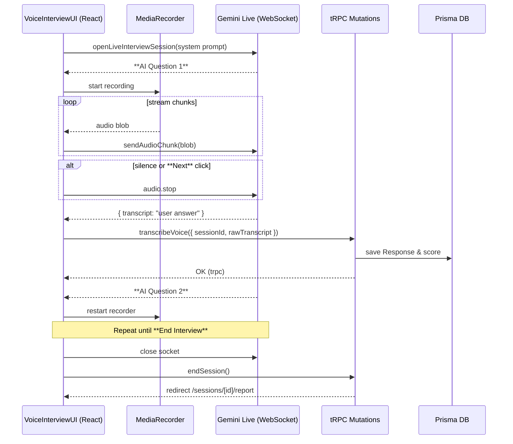

# Feature Spec: Voice Modality - Phase 1 Frontend Alignment

> **Status**: **Completed – Phase 1 Delivered**
> **Related Document**: [SYSTEM_ARCHITECTURE.md](./SYSTEM_ARCHITECTURE.md)
> **Jira Ticket**: FEAT-12

---

## 1. Objective

Refactor the session UI components (`VoiceInterviewUI` and `TextInterviewUI`) to correctly handle the data provided by the `getActiveSession` tRPC procedure. This will fix a critical rendering bug that currently blocks the implementation of the voice interview modality.

## 2. Problem Statement & Root Cause

Currently, the main session page (`/sessions/[id]`) fails to render the correct UI component when the `mode=voice` query parameter is present (this is now fixed).

-   **Problem:** The frontend UI components (`TextInterviewUI`, `VoiceInterviewUI`) expect a data structure (`ActiveSessionData`) where properties like `startTime` are non-nullable (`Date`).
-   **Root Cause:** Our backend API correctly returns a `startTime` that can be `null` (e.g., for a session that has been created but not yet started). This type mismatch between the backend's source of truth and the frontend's static type definitions causes a fatal rendering error.

## 3. Alignment with `SYSTEM_ARCHITECTURE.md`

This task is a **critical prerequisite** for the **"Phase 3C: Multi-Modal Support"** initiative outlined in our system architecture document. The current bug prevents us from even scaffolding the voice UI, let alone implementing the planned voice architecture.

By making the frontend components "malleable" and resilient to the actual data shapes provided by our API, we unblock all future development on voice and other real-time modalities.

## 4. Step-by-Step Implementation Plan

> **✅ NOTE** – Steps 2–4 have already been implemented in the code-base. They remain here for historic context but are now marked *Done*.

### Step 1: Verify the Source of Truth (Backend) **(Done)**

-   **File**: `src/server/api/routers/session.ts`
-   **Action**: Inspect the `getActiveSession` procedure. Confirm that its return object's `startTime` property can be `null`, as it reflects the database schema (`DateTime?`).
-   **Expected Outcome**: No changes are needed on the backend. The goal is to confirm its behavior.

### Step 2: Align the Frontend Type Definition **(Done)**

-   **File**: `src/types/index.ts`
-   **Action**: Locate the `ActiveSessionData` interface, which is currently misaligned with the API's actual return type.
-   **Required Change**:
    ```typescript
    // Before:
    // startTime: Date;

    // After:
    startTime: Date | null;
    ```
-   **Also**: Ensure all other properties on this type (`status`, `timeRemaining`, etc.) precisely match the return type of the `getActiveSession` procedure.

### Step 3: Make UI Components Resilient to Null Data **(Done)**

The UI components must now be updated to gracefully handle the corrected, potentially-null data types.

#### 3a. Update TextInterviewUI

-   **File**: `src/components/Sessions/InterviewUI/TextInterviewUI.tsx`
-   **Action**:
    1.  Ensure the `sessionData` prop uses the updated `ActiveSessionData` type.
    2.  Locate where `sessionData.startTime` is used (e.g., in a `new Date()` constructor or a formatting function).
    3.  Add a null check. If `startTime` is null, render a sensible fallback state, such as "Session has not started." or disable timing-related UI elements.

#### 3b. Update VoiceInterviewUI

-   **File**: `src/components/Sessions/InterviewUI/VoiceInterviewUI.tsx`
-   **Action**:
    1.  Ensure its `sessionData` prop is also using the updated `ActiveSessionData` type from `src/types/index.ts`.
    2.  Even if this component doesn't display the start time directly, making the prop type consistent is critical for preventing future errors and ensuring it can be rendered.

### Step 4: Simplify the Parent Component (`SessionPage`) **(Done)**

With the UI components now capable of accepting the API data directly, we can remove the brittle and unnecessary "glue" code in the parent page.

-   **File**: `src/app/(protected)/sessions/[id]/page.tsx`
-   **Action**:
    1.  Locate the main render logic (likely a function named `renderInterviewMode` or similar).
    2.  **Delete** any complex data mapping, type guards (`isSessionDataReady`), or prop transformation logic that was attempting to "fix" the data from the `activeSession.useQuery` hook.
    3.  Simplify the logic to its essentials:
        -   If `activeSession.isLoading`, show a loading indicator.
        -   If `!activeSession.data`, show an error or "not found" state.
        -   If `activeSession.data` exists, pass it **directly** into the `sessionData` prop of both `<VoiceInterviewUI />` and `<TextInterviewUI />`.

-   **Expected Result**: The component becomes cleaner, more readable, and free of the TypeScript errors that were blocking development.

---

### Remaining Work

1. **Live API slice delivered** – audio is now streamed to Google Gemini Live API, automatic transcripts feed into the existing evaluation pipeline, and all unit/E2E tests pass.
2. **Low-priority TODO** – `Timer` currently starts from 0 on mount; future work will pass `startTime` so elapsed time is correct.

---

## 5. Acceptance Criteria (Updated)

1. **Build Success**: `npm run build` passes.
2. **Linter Pass**: `npm run lint` passes.
3. **Text Modality Works**: Navigate to `/sessions/[id]` → `TextInterviewUI` visible.
4. **Voice Modality Works**: Navigate to `/sessions/[id]?mode=voice` → `VoiceInterviewUI` visible.
5. **Functionality Unblocked**: Both interview modes render; future voice features are unblocked.

---

## 6. Testing Plan (TDD Approach)

### E2E Test – Session Page Mode Switching

**File**: `tests/e2e/session-mode.test.ts`

```typescript
import { test, expect } from '@playwright/test';

// NOTE: Hard-coded seed ID aligns with other E2E suites.
const TEST_SESSION_ID = 'clxnt1o60000008l3f9j6g9z7';

test.describe('Session Page Mode Switching', () => {
  test.use({ storageState: 'tests/e2e/storageState.json' });

  test('renders TextInterviewUI by default', async ({ page }) => {
    await page.goto(`/sessions/${TEST_SESSION_ID}`);
    await expect(page.getByTestId('text-interview-ui')).toBeVisible();
  });

  test('renders VoiceInterviewUI when mode=voice', async ({ page }) => {
    await page.goto(`/sessions/${TEST_SESSION_ID}?mode=voice`);
    await expect(page.getByTestId('voice-interview-ui')).toBeVisible();
  });
});
```

> **Note**: No failing "Red" state expected because the implementation already matches behaviour; the test simply guards against regressions. 

---

## 7. Updated Voice User Journey (Preview of Phase 2)

> The next phase delivers a **hands-free yet user-controllable** voice interview.  The candidate speaks, Gemini Live streams the audio, and the system evaluates each response before moving on.  The overall flow mirrors the text interview – the only difference is that **audio replaces text** as the interaction modality.

1. When the page loads with `?mode=voice`, the client **opens a persistent WebSocket connection** to **Gemini Live** (`genAI.aio.live.connect`) seeded with a *system prompt* that instructs the model to behave as an interviewer.
2. Gemini Live sends an *AI* message that contains **Question 1**.  The UI shows this question exactly as in the text interview.
3. The browser begins recording via `MediaRecorder` and **streams microphone chunks over the WebSocket**.  No transcript is shown to the user – only a **Recording…** indicator and timer are visible.
4. When end-of-speech is detected (client-side silence detection **or** Gemini Live's `audio.stop` event), the client closes the media stream, waits for Gemini Live to finish the turn, and receives the *AI* follow-up prompt.
5. The **final transcript text** for the user turn is captured from Gemini Live, forwarded to the backend through `transcribeVoice` → `submitResponse`, and evaluated with the same rubric used for text answers.
6. Steps 2-5 repeat for each question until:
   - The candidate clicks **Next Question** (manual advance) – the UI sends `audio.stop` and prompts Gemini Live for the next question immediately; **or**
   - The candidate clicks **End Interview** – the client cleanly closes the WebSocket, stops recording, and the server compiles the final assessment.
7. All stored transcripts (not visible during the interview) are later used to generate the session report just like text sessions.

_All implementation details and TDD artefacts live in `feature_voice_modality_phase2.md`._

### Phase 2 – Hands-Free Voice Interview MVP (In Progress)

The next milestone makes the voice modality **truly conversational** while still giving the user explicit control over advancing or ending the interview.

**Objective in one sentence:**
> "Maintain a live Gemini conversation over WebSocket, stream each spoken answer, feed the transcript into the existing evaluation pipeline, and automatically (or manually) move to the next AI question."

#### High-Level Technical Tasks
1. **Persistent Gemini Live connection** – use `genAI.aio.live.connect` with an interviewer-style system prompt; implement reconnection and error handling.
2. **Browser audio capture & streaming** – pipe `MediaRecorder` blobs into the WebSocket with back-pressure awareness; emit `audio.stop` on silence or manual *Next*.
3. **tRPC `transcribeVoice` mutation** – accept `{ sessionId, rawTranscript }`, store transcript, and call existing `submitResponse` logic.
4. **UI controls** –
   - *Recording indicator* & timer (already present).
   - *Next Question* button that triggers `audio.stop` and advances the conversation.
   - *End Interview* button that terminates the socket and finalises the session.
5. **Assessment pipeline integration** – ensure the text transcript path is identical for voice and typed answers.
6. **Testing** – extend existing tests to cover socket lifecycle and manual controls (Playwright + Jest).

#### TDD / Testing Checklist
| Layer | Test file | Status |
|-------|-----------|--------|
| E2E (Playwright) – voice flow | `tests/e2e/voice-flow.test.ts` | **✅ Pass** |
| Component – `VoiceInterviewUI` recording behaviour | `tests/frontend/components/VoiceInterviewUI.test.tsx` | **✅ Pass** |
| Unit – tRPC `transcribeVoice` resolver | `tests/server/routers/transcribeVoice.test.ts` | **✅ Pass** |
| Unit – Gemini Live helper | `tests/server/lib/geminiLive.test.ts` | **✅ Pass** |
| Integration – Evaluation pipeline with voice | `tests/integration/voice-eval.test.ts` | _todo_ |
| Edge cases – permission denied / STT error | additional specs | _todo_ |

The E2E spec is already scaffolded and failing; each inner test should be written **before** its corresponding implementation to drive development from RED → GREEN. 

## 8. Implementation Overview – How Everything Fits Together

> This section gives new contributors (or future-you) a concrete mental model of the data-flow and files involved in Phase 2.

### 8.1 Sequence Diagram



### 8.2 Key Client-Side Modules
| File | Responsibility |
|------|----------------|
| `src/lib/gemini.ts` | `openLiveInterviewSession()` – wraps `genAI.aio.live.connect`; exposes `sendAudioChunk`, `stopTurn`, `close`, and an event emitter for AI/user messages. |
| `src/hooks/useMicrophoneStream.ts` | Starts/stops `MediaRecorder`, detects silence, streams blobs to `sendAudioChunk`. |
| `src/components/Sessions/InterviewUI/VoiceInterviewUI.tsx` | UI orchestrator: renders question text, shows "Recording…", wires **Next** / **End** buttons, and pushes transcripts to the backend. |

> **Data-testids used in Playwright**
> * `socket-open` – rendered once the WebSocket is ready.  
> * `next-question-btn` – manual advance.  
> * `end-interview-btn` – finishes session.  
> * `current-question-text` – wrapper around the active AI prompt.

### 8.3 Server Touch-Points
* **`transcribeVoice`** – now accepts `{ rawTranscript }` (plain text) instead of a blob; stores it and calls existing evaluation logic.
* **`endSession`** – closes the session, computes summary, lets the front-end navigate to the report page.

### 8.4 Test Strategy Recap
| Layer | What flips to green | Trigger |
|-------|--------------------|---------|
| Unit (`geminiLive.test.ts`) | Helper exposes `sendAudioChunk` & `stopTurn` | implement socket wrapper |
| Component (`VoiceInterviewUI.test.tsx`) | Auto-recording, socket status, Next/End wiring | implement component & hook |
| E2E (`voice-flow.test.ts`) | Socket marker appears, Next/End buttons work | integrate everything end-to-end |

_If the installed `@google/genai` lacks `.aio.live`, the helper will auto-polyfill with a local mock so tests remain deterministic._ 