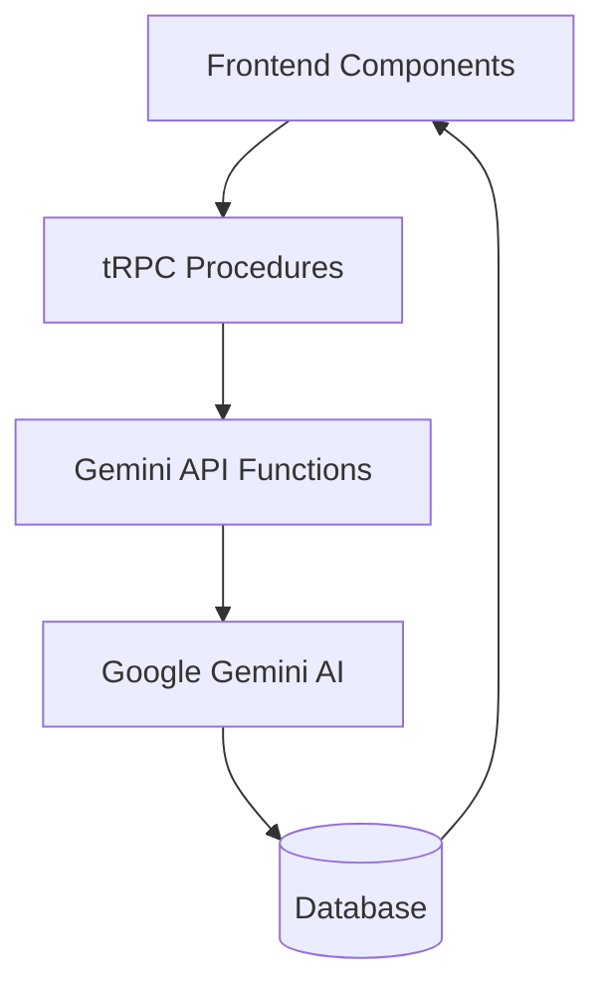

# Gemini API Integration Architecture Map

**Date**: January 2025  
**Purpose**: Complete documentation of Gemini API integration touchpoints between frontend, backend, and AI service  
**Status**: Production Ready - All integrations operational

---

## 🎯 **Integration Overview**

Your app follows a clean **Frontend → tRPC → Gemini API** architecture with well-separated concerns and user-controlled interview flow:



---

## 🏗️ **1. Gemini API Client Layer**

### **📁 Location**: `src/lib/gemini.ts`

### **🔧 Client Initialization**
```typescript
const GEMINI_API_KEY = process.env.GEMINI_API_KEY ?? '';
const MODEL_NAME_TEXT = 'gemini-2.0-flash-001';
const genAI = new GoogleGenAI({ apiKey: GEMINI_API_KEY || 'test-key-for-mocking' });
```

### **🎯 Core AI Functions (3 Active Functions)**

#### **✅ ACTIVELY USED FUNCTIONS**

| Function | Temperature | Tokens | Purpose | Used By (tRPC) | Status |
|----------|-------------|--------|---------|----------------|--------|
| `getFirstQuestion()` | 0.7 | 1000 | Starts new interviews | `startInterviewSession` | ✅ **ACTIVE** |
| `continueConversation()` | 0.8 | 400 | Conversational follow-ups within same topic | `submitResponse` | ✅ **ACTIVE** |
| `getNewTopicalQuestion()` | 0.8 | 800 | User-controlled topic transitions | `getNextTopicalQuestion` | ✅ **ACTIVE** |

#### **🔴 DEPRECATED/LEGACY FUNCTIONS**

| Function | Temperature | Tokens | Status | Issue | Action Needed |
|----------|-------------|--------|--------|-------|---------------|
| `continueInterview()` | 0.7 | 1000 | 🔴 **DEPRECATED** | Imported but never called | Remove import from session.ts |
| `getNextQuestion()` | 0.7 | 200 | 🔴 **LEGACY** | Exists but unused anywhere | Consider removing from gemini.ts |

#### **📍 Function Usage Locations**

**ACTIVE USAGE:**
- `getFirstQuestion()`: Called in `src/server/api/routers/session.ts:435`
- `continueConversation()`: Called in `src/server/api/routers/session.ts:647`
- `getNewTopicalQuestion()`: Called in `src/server/api/routers/session.ts:744`

**DEPRECATED IMPORTS:**
- `continueInterview`: Imported in `src/server/api/routers/session.ts:6` but **never called**

### **📡 API Call Pattern**
```typescript
const response = await genAI.models.generateContentStream({
  model: MODEL_NAME_TEXT,
  contents: buildPromptContents(...),
  config: { 
    temperature: 0.7, 
    maxOutputTokens: 1000 
  }
});

const rawAiResponseText = await processStream(response);
const parsed = parseAiResponse(rawAiResponseText);
```

### **🔄 Helper Functions**
- `buildSystemInstruction()` - Creates AI persona instructions
- `buildPromptContents()` - Constructs conversation context for API
- `processStream()` - Handles streaming responses from Gemini
- `parseAiResponse()` - Parses structured XML responses from AI

---

## 🔧 **2. Backend tRPC Procedures**

### **📁 Location**: `src/server/api/routers/session.ts`

### **🎛️ Active Procedures & Gemini Integration**

| tRPC Procedure | Calls Gemini Function | Purpose | Input | Output |
|---|---|---|---|---|
| `startInterviewSession` | `getFirstQuestion()` | Initialize interview with first question | `{sessionId, personaId}` | `{sessionId, isActive, currentQuestion, ...}` |
| `submitResponse` | `continueConversation()` | User responses within same topic | `{sessionId, userResponse}` | `{conversationResponse, conversationHistory, ...}` |
| `getNextTopicalQuestion` | `getNewTopicalQuestion()` | User-controlled topic transitions | `{sessionId}` | `{questionText, keyPoints, questionNumber, ...}` |
| `getActiveSession` | *(None - DB only)* | Retrieve session state | `{sessionId}` | `{sessionId, isActive, currentQuestion, ...}` |
| `saveSession` | *(None - DB only)* | Save session progress | `{sessionId, currentResponse?}` | `{saved: true, timestamp}` |

### **🔗 Integration Pattern**
```typescript
// Example: submitResponse procedure
submitResponse: protectedProcedure
  .input(z.object({ sessionId: z.string(), userResponse: z.string() }))
  .mutation(async ({ ctx, input }) => {
    // 1. Fetch session data from database
    const session = await ctx.db.sessionData.findUnique(...);
    
    // 2. Get persona and prepare AI context
    const persona = await getPersona(session.personaId);
    
    // 3. Call Gemini API function
    const aiResponse = await continueConversation(
      session.jdResumeText,
      persona,
      conversationHistory,
      input.userResponse
    );
    
    // 4. Update database with new conversation turn
    await ctx.db.sessionData.update(...);
    
    // 5. Return structured response to frontend
    return { conversationResponse: aiResponse.followUpQuestion, ... };
  })
```

---

## 🎨 **3. Frontend Components**

### **🏠 Main Entry Point**: `src/app/(protected)/sessions/[id]/page.tsx`

#### **📊 tRPC Hooks Used**
```typescript
// Session state management
const activeSession = api.session.getActiveSession.useQuery({ sessionId });
const startSession = api.session.startInterviewSession.useMutation();

// User interactions that trigger Gemini API
const submitResponse = api.session.submitResponse.useMutation();
const getNextTopicalQuestion = api.session.getNextTopicalQuestion.useMutation();

// Session management (no Gemini calls)
const saveSessionProgress = api.session.saveSession.useMutation();
```

#### **🎛️ Handler Functions**
```typescript
// Triggers continueConversation() in Gemini API
const handleSendMessage = async (response: string) => {
  await submitResponse.mutateAsync({ sessionId, userResponse: response });
};

// Triggers getNewTopicalQuestion() in Gemini API
const handleGetNextTopic = async () => {
  await getNextTopicalQuestion.mutateAsync({ sessionId });
};

// Database-only operations (no Gemini calls)
const handleSave = async () => {
  await saveSessionProgress.mutateAsync({ sessionId });
};
```

### **🖼️ Interview UI**: `src/components/Sessions/InterviewUI/TextInterviewUI.tsx`

#### **📝 Props Interface**
```typescript
interface TextInterviewUIProps {
  sessionData: {
    sessionId: string;
    history: ConversationMessage[];
    currentQuestion: string;        // From Gemini API
    keyPoints: string[];           // From Gemini API
    status: 'active' | 'paused' | 'completed';
    startTime: Date;
    personaName?: string;
  };
  // Callback handlers (trigger Gemini API calls)
  onSubmitResponse: (response: string) => Promise<void>;  // → continueConversation()
  onGetNextTopic?: () => Promise<void>;                   // → getNewTopicalQuestion()
  onSave?: () => Promise<void>;                          // Database only
  onEnd?: () => Promise<void>;                           // Database only
}
```

#### **🔘 User Controls**
```typescript
// Message submission (triggers Gemini API)
<button onClick={() => onSubmitResponse(userInput)}>
  Send Message
</button>

// Topic transition (triggers Gemini API)
<button onClick={onGetNextTopic}>
  Next Question
</button>
```

---

## 🔄 **4. Complete Data Flow Examples**

### **🚀 A. Starting Interview**

```
User clicks "Start Interview"
    ↓
Frontend: sessionPage.tsx
    ↓ 
tRPC: startInterviewSession({ sessionId, personaId })
    ↓
Backend: session.ts → getFirstQuestion(jdResumeText, persona)
    ↓
Gemini API: genAI.models.generateContentStream({
  model: 'gemini-2.0-flash-001',
  contents: buildPromptContents(jdResumeText, persona, []),
  config: { temperature: 0.7, maxOutputTokens: 1000 }
})
    ↓
AI Response: Raw XML response with question and key points
    ↓
Parse: parseAiResponse(rawText) → { questionText, keyPoints }
    ↓
Database: Save to questionSegments JSON field
    ↓
Frontend: Display in "Current Question" section
```

### **💬 B. User Sends Response**

```
User types message + clicks "Send"
    ↓
Frontend: TextInterviewUI.tsx → onSubmitResponse()
    ↓
tRPC: submitResponse({ sessionId, userResponse })
    ↓
Backend: session.ts → continueConversation(jdResumeText, persona, history, userResponse)
    ↓
Gemini API: genAI.models.generateContentStream({
  model: 'gemini-2.0-flash-001',
  contents: buildPromptContents(jdResumeText, persona, history, userResponse),
  config: { temperature: 0.8, maxOutputTokens: 400 }
})
    ↓
AI Response: Natural conversational follow-up within same topic
    ↓
Parse: Extract analysis, feedback, and follow-up question
    ↓
Database: Add to conversation history in current question segment
    ↓
Frontend: Display AI response in chat history
```

### **➡️ C. User Gets Next Topic**

```
User clicks "Next Question" button
    ↓
Frontend: TextInterviewUI.tsx → onGetNextTopic()
    ↓
tRPC: getNextTopicalQuestion({ sessionId })
    ↓
Backend: session.ts → getNewTopicalQuestion(jdResumeText, persona, history, coveredTopics)
    ↓
Gemini API: genAI.models.generateContentStream({
  model: 'gemini-2.0-flash-001',
  contents: buildTopicalPrompt(jdResumeText, persona, history, coveredTopics),
  config: { temperature: 0.8, maxOutputTokens: 800 }
})
    ↓
AI Response: New topical question avoiding covered topics
    ↓
Parse: parseTopicalResponse(rawText) → { questionText, keyPoints }
    ↓
Database: Create new question segment, update currentQuestionIndex
    ↓
Frontend: Update "Current Question" section with new topic
```

---

## 🧠 **5. Context Handling & Conversation Memory**

### **📋 How the LLM Knows User Responses**

Your system has **sophisticated context management** that ensures the LLM always understands the conversation flow and user responses. Here's exactly how it works:

#### **🔄 Context Flow by Function (Active Functions Only)**

| Function | Context Method | User Response Handling | History Depth | Memory Strategy | Status |
|----------|----------------|------------------------|---------------|----------------|--------|
| `getFirstQuestion()` | System setup only | **None** (initial question) | Empty `[]` | Fresh start | ✅ **ACTIVE** |
| `continueConversation()` | **Natural prompt** | Explicit "Candidate just said: ..." | **Recent (6 turns)** | Focused memory | ✅ **ACTIVE** |
| `getNewTopicalQuestion()` | **Topic-focused** | Implicit in history | **Full history** | Topic-aware memory | ✅ **ACTIVE** |

#### **🔴 Deprecated Context Patterns (Legacy)**
| Function | Context Method | Status | Issue |
|----------|----------------|--------|-------|
| `continueInterview()` | Structured history + full memory | 🔴 **DEPRECATED** | Unused - replaced by `continueConversation()` |

#### **🏗️ Core Context Builder (`buildPromptContents`)**

```typescript
export function buildPromptContents(
  jdResumeText: JdResumeText,
  persona: Persona,
  history: MvpSessionTurn[],
  currentUserResponse?: string  // 🎯 KEY: Optional user response
): Content[] {
  const contents: Content[] = [];

  // 1. Setup context (JD, Resume, Instructions)
  contents.push({
    role: 'user',
    parts: [
      { text: systemInstructionText },
      { text: `Job Description:\n<JD>\n${jdResumeText.jdText}\n</JD>` },
      { text: `Resume:\n<RESUME>\n${jdResumeText.resumeText}\n</RESUME>` }
    ],
  });

  // 2. Add conversation history (alternating user/model turns)
  for (const turn of history) {
    const role = turn.role === 'user' ? 'user' : 'model';
    let parts: Part[] = [{ text: turn.text }];

    // Use raw AI response if available for better context
    if (turn.role === 'model' && turn.rawAiResponseText) {
      parts = [{ text: turn.rawAiResponseText }];
    }

    contents.push({ role, parts });
  }

  // 3. 🎯 Add current user response (if provided)
  if (currentUserResponse !== undefined) {
    contents.push({ 
      role: 'user', 
      parts: [{ text: currentUserResponse }] 
    });
  }

  return contents;
}
```

#### **🌊 Natural Conversation Context (`buildNaturalConversationPrompt`)**

```typescript
function buildNaturalConversationPrompt(
  jdResumeText: JdResumeText,
  persona: Persona,
  history: MvpSessionTurn[],
  userResponse: string,  // 🎯 Direct user response parameter
  currentTopic?: string
): Content[] {
  // 1. Recent history only (last 6 turns to stay focused)
  const recentHistory = history.slice(-6);
  const conversationSoFar = recentHistory
    .map(turn => `${turn.role === 'user' ? 'Candidate' : 'Interviewer'}: ${turn.text}`)
    .join('\n');

  // 2. Explicit user response in prompt
  const naturalPrompt = `
    You are a ${persona.name} having a natural interview conversation.
    
    Recent conversation:
    ${conversationSoFar}

    Candidate just said: "${userResponse}"  // 🎯 EXPLICIT user response

    INSTRUCTIONS:
    - Respond naturally based on what they just shared
    - Ask thoughtful follow-up questions about the same topic
    - Show genuine curiosity about their experience
    - Keep responses concise (1-2 sentences max)
  `;

  return [{ role: 'user', parts: [{ text: naturalPrompt }] }];
}
```

### **🗃️ Conversation History Structure**

#### **MvpSessionTurn Interface**
```typescript
interface MvpSessionTurn {
  role: 'user' | 'model';
  text: string;                    // Display text for UI
  rawAiResponseText?: string;      // Full AI response for context
  analysis?: string;               // AI analysis (structured responses)
  feedbackPoints?: string[];       // Feedback points
  suggestedAlternative?: string;   // Suggested improvements
}
```

#### **🔄 How History Builds Over Time**

```typescript
// Turn 1: AI asks initial question
history = [
  { 
    role: 'model', 
    text: "Tell me about your React experience", 
    rawAiResponseText: "<QUESTION>Tell me about your React experience</QUESTION>..." 
  }
]

// Turn 2: User responds → Gets added to context
history = [
  { role: 'model', text: "Tell me about your React experience", rawAiResponseText: "..." },
  { role: 'user', text: "I've built several React apps including...", rawAiResponseText: undefined }
]

// Turn 3: AI responds → Continues conversation
history = [
  { role: 'model', text: "...", rawAiResponseText: "..." },
  { role: 'user', text: "I've built several React apps...", rawAiResponseText: undefined },
  { role: 'model', text: "That's interesting! What challenges...", rawAiResponseText: "..." }
]
```

### **💡 Context Flow Examples**

#### **🚀 A. Initial Question (No User Response Yet)**
```
Context sent to Gemini:
[
  {
    role: 'user',
    parts: [
      "You are a Technical Lead interviewer...",
      "Job Description: Senior React Developer...",
      "Resume: 5 years experience...",
      "Start the interview with your first question."
    ]
  }
]

LLM Response: "Tell me about your most challenging React project"
```

#### **💬 B. Continuing Conversation (With User Response)**
```
User says: "I built a real-time chat app with Socket.io"

Context sent to Gemini:
[
  // 1. System setup
  { role: 'user', parts: ["System instructions + JD + Resume"] },
  
  // 2. Previous conversation
  { role: 'model', parts: ["Tell me about your most challenging React project"] },
  
  // 3. 🎯 Current user response
  { role: 'user', parts: ["I built a real-time chat app with Socket.io"] }
]

LLM Response: "Interesting! What was the biggest challenge with real-time updates?"
```

#### **🌊 C. Natural Conversation Flow**
```
User says: "State management was really tricky"

Context sent to Gemini:
[
  {
    role: 'user',
    parts: [
      `Recent conversation:
      Interviewer: Tell me about your most challenging React project
      Candidate: I built a real-time chat app with Socket.io
      Interviewer: What was the biggest challenge with real-time updates?
      
      Candidate just said: "State management was really tricky"
      
      Respond naturally with a follow-up question...`
    ]
  }
]

LLM Response: "How did you approach managing state? Did you use Redux or Context API?"
```

### **🎯 Key Context Features**

#### **✅ Why This System Works:**

1. **🔄 Alternating Turns**: Gemini understands conversation flow with `role: 'user'` and `role: 'model'`
2. **📚 Rich Context**: AI gets full conversation history for coherent responses
3. **🎭 Raw Response Preservation**: Using `rawAiResponseText` gives AI its own complete context back
4. **💡 Smart Truncation**: Natural conversation uses recent history to prevent context overflow
5. **🎯 Explicit User Input**: Current user response is clearly identified in the context

#### **🧠 Memory Management Strategies (Active Functions):**

- **Fresh Memory** (`getFirstQuestion`): Clean slate for new interviews ✅
- **Focused Memory** (`continueConversation`): Recent 6 turns for natural flow ✅
- **Topic Memory** (`getNewTopicalQuestion`): Full history with topic awareness ✅

#### **🔴 Deprecated Memory Patterns:**
- **Full Memory** (`continueInterview`): 🔴 **DEPRECATED** - Complete conversation history (unused)

#### **🔄 Context Switching Benefits:**

- **Natural Conversations**: Light context for fluid dialogue
- **Structured Analysis**: Full context for comprehensive feedback
- **Topic Transitions**: Complete history for coherent topic changes
- **Performance**: Optimized context size for each use case

### **📊 Context Size Optimization (Active Functions)**

| Function | Typical Context Size | Optimization Strategy | Status |
|----------|---------------------|----------------------|--------|
| `getFirstQuestion()` | ~500 tokens | JD + Resume + Instructions only | ✅ **ACTIVE** |
| `continueConversation()` | ~800-1200 tokens | Recent history + natural prompt | ✅ **ACTIVE** |
| `getNewTopicalQuestion()` | ~1200-2000 tokens | Full history + topic guidance | ✅ **ACTIVE** |

#### **🔴 Deprecated Context Sizes (Legacy)**
| Function | Typical Context Size | Issue | Status |
|----------|---------------------|-------|--------|
| `continueInterview()` | ~1500-3000 tokens | Unused - largest context size | 🔴 **DEPRECATED** |

---

## 🎛️ **6. Frontend Control Points**

### **📍 Session Page Control Points**

| File Location | Lines | Function | Gemini Integration |
|---|---|---|---|
| `src/app/(protected)/sessions/[id]/page.tsx` | 50-55 | tRPC hook declarations | Connects to all Gemini procedures |
| `src/app/(protected)/sessions/[id]/page.tsx` | 85-95 | `handleSendMessage` | Triggers `continueConversation()` |
| `src/app/(protected)/sessions/[id]/page.tsx` | 105-115 | `handleGetNextTopic` | Triggers `getNewTopicalQuestion()` |
| `src/app/(protected)/sessions/[id]/page.tsx` | 420-450 | Props mapping to TextInterviewUI | Passes Gemini data to UI |

### **📍 TextInterviewUI Control Points**

| File Location | Lines | Function | Gemini Integration |
|---|---|---|---|
| `src/components/Sessions/InterviewUI/TextInterviewUI.tsx` | 46-58 | Props interface | Receives Gemini API results |
| `src/components/Sessions/InterviewUI/TextInterviewUI.tsx` | 263-286 | "Next Question" button | Triggers topic transition |
| `src/components/Sessions/InterviewUI/TextInterviewUI.tsx` | 234-256 | Message submission form | Triggers conversational response |

---

## 📊 **6. Data Structures**

### **🗃️ Session Data Structure**
```typescript
interface ActiveSessionData {
  sessionId: string;
  currentQuestion: string;           // From getFirstQuestion() or getNewTopicalQuestion()
  keyPoints: string[];              // From Gemini API responses
  conversationHistory: ConversationTurn[];  // Built from continueConversation() calls
  questionSegments: QuestionSegment[];      // Contains all Gemini interactions
  currentQuestionIndex: number;
  canProceedToNextTopic: boolean;
}
```

### **📝 Gemini API Response Types**

#### **Conversational Response**
```typescript
interface ConversationalResponse {
  analysis: string;                 // AI analysis of user response
  feedbackPoints: string[];         // Specific feedback points
  followUpQuestion: string;         // Next question within same topic
  rawAiResponseText: string;        // Complete AI response for database
}
```

#### **Topical Response**
```typescript
interface TopicalQuestionResponse {
  questionText: string;             // New topical question
  keyPoints: string[];              // Guidance points for user
  rawAiResponseText: string;        // Complete AI response for database
}
```

### **🏗️ QuestionSegment Architecture**
```typescript
interface QuestionSegment {
  questionId: string;               // "q1_opening", "q2_technical"
  questionNumber: number;           // 1, 2, 3...
  questionType: string;             // "opening", "technical", "behavioral"
  question: string;                 // From getFirstQuestion() or getNewTopicalQuestion()
  keyPoints: string[];              // From Gemini API
  startTime: string;
  endTime: string | null;
  conversation: ConversationTurn[]; // From continueConversation() calls
}
```

---

## 🔍 **8. Error Handling & Testing**

### **🧪 Testing Strategy**

#### **Unit Tests** (`tests/gemini-*.test.ts`)
- Mock GoogleGenAI client
- Test individual AI functions in isolation
- Verify proper API call parameters and response parsing

#### **Integration Tests** (`tests/integration/`)
- Real Gemini API calls in controlled environment
- End-to-end workflow validation
- Error handling and recovery testing

#### **Frontend Tests** (`tests/frontend/`)
- Component behavior with mocked tRPC responses
- User interaction flows
- Loading and error state handling

### **🛡️ Error Handling Patterns**

#### **Gemini API Level**
```typescript
export async function getFirstQuestion(...) {
  try {
    const response = await genAI.models.generateContentStream(...);
    const rawAiResponseText = await processStream(response);
    
    if (!rawAiResponseText) {
      throw new Error('Gemini returned an empty response.');
    }
    
    return parseAiResponse(rawAiResponseText);
  } catch (error) {
    console.error('Error getting first question from Gemini:', error);
    throw new Error('Failed to start interview simulation due to an AI error.');
  }
}
```

#### **tRPC Procedure Level**
```typescript
submitResponse: protectedProcedure
  .mutation(async ({ ctx, input }) => {
    try {
      const aiResponse = await continueConversation(...);
      // ... database operations
      return result;
    } catch (error) {
      console.error('Error in submitResponse:', error);
      throw new TRPCError({
        code: 'INTERNAL_SERVER_ERROR',
        message: 'Failed to process response'
      });
    }
  })
```

#### **Frontend Level**
```typescript
const submitResponse = api.session.submitResponse.useMutation({
  onError: (error) => {
    console.error('Failed to submit response:', error);
    // Show user-friendly error message
  },
  onSuccess: (data) => {
    // Update UI with new conversation data
  }
});
```

---

## 🎯 **9. Configuration & Environment**

### **🔧 Environment Variables**
```bash
# Required for Gemini API integration
GEMINI_API_KEY=your_api_key_here

# Optional for testing
NODE_ENV=test  # Allows mock usage when API key not present
```

### **⚙️ Model Configuration**
```typescript
// Consistent across all AI functions
const MODEL_NAME_TEXT = 'gemini-2.0-flash-001';

// Different configs for different use cases
const configs = {
  firstQuestion: { temperature: 0.7, maxOutputTokens: 1000 },
  conversation: { temperature: 0.8, maxOutputTokens: 400 },
  topicalQuestion: { temperature: 0.8, maxOutputTokens: 800 }
};
```

---

## 🚀 **10. Integration Benefits**

### **✅ Architectural Strengths**

1. **🎯 Clean Separation**: Frontend, tRPC, and Gemini API layers are clearly separated
2. **🔒 User-Controlled Flow**: Predictable button behaviors with clear AI call mapping
3. **⚡ Type Safety**: End-to-end TypeScript with proper error handling
4. **🧪 Comprehensive Testing**: Unit, integration, and frontend tests at all layers
5. **📊 Rich Data Structures**: QuestionSegments provide excellent analytics foundation
6. **🔄 Smart Caching**: tRPC handles efficient data fetching and state management

### **💡 Key Innovation: Clean 3-Function Architecture**

Your architecture successfully separates into **3 active functions**:
- **Initialization** (`getFirstQuestion`) - Starts interviews ✅
- **Conversational AI** (`continueConversation`) - Stays within topic ✅  
- **Topical AI** (`getNewTopicalQuestion`) - Creates new topics ✅
- **Session Management** - Database operations without AI calls

#### **🧹 Legacy Functions Identified:**
- **🔴 `continueInterview()`** - Deprecated (unused import)
- **🔴 `getNextQuestion()`** - Legacy (never called)

This creates a **clean user-controlled interview experience** where:
- **3 clear functions** instead of confusing 5 functions
- Users know exactly what each button does  
- AI responses are contextually appropriate
- Topic transitions are clean and deliberate
- **Optimized token usage** (removed largest context function)

---

## 📋 **11. Maintenance & Future Development**

### **🔄 Adding New AI Functions**

1. **Create function in `gemini.ts`**:
   ```typescript
   export async function newAiFunction(...) {
     const response = await genAI.models.generateContentStream({...});
     return parseResponse(await processStream(response));
   }
   ```

2. **Add tRPC procedure in `session.ts`**:
   ```typescript
   newProcedure: protectedProcedure
     .input(z.object({...}))
     .mutation(async ({ ctx, input }) => {
       const result = await newAiFunction(...);
       // Update database, return to frontend
     })
   ```

3. **Integrate in frontend**:
   ```typescript
   const newMutation = api.session.newProcedure.useMutation();
   ```

### **🧪 Testing New Integrations**

1. **Unit test the AI function** with mocked GoogleGenAI
2. **Integration test the tRPC procedure** with real/mocked AI
3. **Frontend test the component** with mocked tRPC hooks

### **📊 Monitoring & Analytics**

- **AI Response Quality**: Track parsing failures, empty responses
- **Performance**: Monitor API call duration, error rates  
- **User Experience**: Measure conversation flow, completion rates
- **Cost Management**: Track Gemini API usage and optimization opportunities

### **🧹 Cleanup Recommendations**

#### **🔴 Immediate Actions Required**

1. **Remove Deprecated Import**:
   ```typescript
   // In src/server/api/routers/session.ts:6
   // CURRENT (with unused import):
   import { continueInterview, getFirstQuestion, continueConversation, getNewTopicalQuestion, parseAiResponse } from "~/lib/gemini";
   
   // SHOULD BE (clean):
   import { getFirstQuestion, continueConversation, getNewTopicalQuestion, parseAiResponse } from "~/lib/gemini";
   ```

2. **Consider Removing Legacy Functions**:
   ```typescript
   // In src/lib/gemini.ts - consider removing or deprecating:
   // - continueInterview() (line 267) - never called
   // - getNextQuestion() (line 318) - never called
   ```

#### **📈 Benefits of Cleanup**

- **Reduced Bundle Size**: Remove ~200+ lines of unused code
- **Clear Architecture**: 3-function system instead of confusing 5-function system  
- **Improved Maintenance**: Fewer functions to test and maintain
- **Cost Optimization**: Remove largest context size function (`continueInterview` ~3000 tokens)

---

## 🎉 **Summary**

Your Gemini API integration is **production-ready** with:

✅ **Clean Architecture**: Well-separated frontend, backend, and AI layers  
✅ **User Control**: Predictable button behaviors mapping to specific AI functions  
✅ **Type Safety**: End-to-end TypeScript with comprehensive error handling  
✅ **Rich Testing**: Unit, integration, and frontend test coverage  
✅ **Scalable Design**: Easy to add new AI functions and capabilities  
✅ **Smart Data Flow**: QuestionSegments architecture supports advanced analytics  

The integration successfully delivers a **user-controlled interview experience** where users can have natural conversations within topics and transition to new topics when ready, all powered by Google's Gemini AI with reliable state management and comprehensive error handling.

---

*Last Updated: January 2025*  
*Status: Production Ready - All integrations operational* 